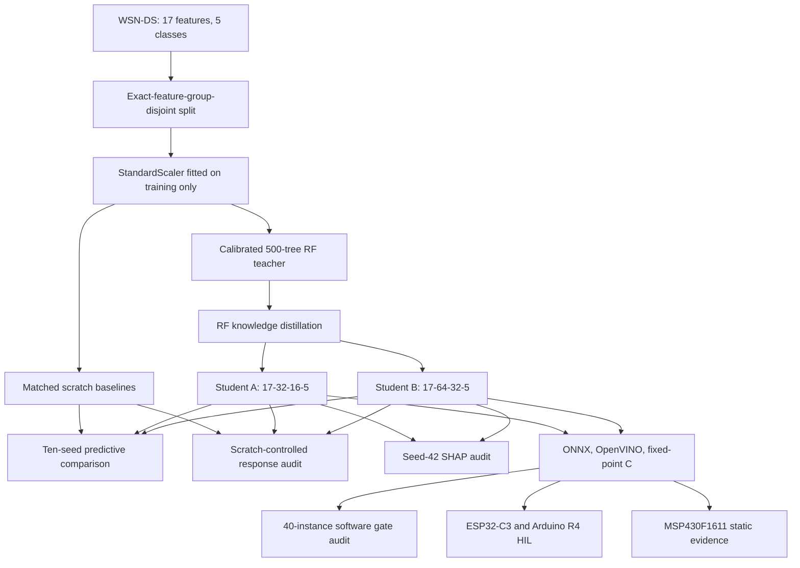

<div align="center">

# CuKD-XAI

### Evidence-driven compression and deployment validation for WSN/IoT intrusion detection


**CuKD-XAI studies whether a calibrated Random Forest intrusion detector can be compressed into KB-scale neural students while preserving measurable predictive behavior and supporting a traceable path from PyTorch to embedded execution.**

</div>

---

## At A Glance

| Item | Current evidence |
|---|---|
| Primary protocol | WSN-DS exact-feature-group-disjoint split with a train-only-fitted scaler |
| Split | 262,197 train, 56,163 validation, and 56,301 test records |
| Statistical scope | Ten optimizer seeds on one fixed split; 2,815,050 primary prediction rows |
| Compact models | Student A: 17-32-16-5, 1,189 parameters; Student B: 17-64-32-5, 3,397 parameters |
| Predictive finding | Paired tests detect no RF-KD macro-F1 advantage on the primary split |
| Transfer finding | RF-KD is closer to the calibrated RF response distribution than matched scratch models in all ten seeds |
| Final USB campaign | Six gate-eligible board-model sessions and 337,806 exact fixed-reference replay rows |
| Evidence status | [`passed_with_open_planned_work`](results/evidence_registry/fgds_20260814_current/EVIDENCE_REGISTRY.md) |

---

## Research Objective

Wireless sensor and IoT intrusion-detection studies often stop at predictive metrics or simulated quantization. CuKD-XAI evaluates a broader research question:

> What predictive behavior, teacher-response behavior, explanation alignment, and execution fidelity remain after a high-capacity tabular IDS is compressed into tiny neural students?

The primary study uses five-class **WSN-DS** intrusion detection. **Edge-IIoTset** provides a secondary, protocol-sensitive robustness study. The authoritative current evidence set is registry `cukd_fgds_evidence_registry_20260814_v3`.

---

## What This Repository Contains

| Area | Evidence |
|---|---|
| Predictive evaluation | Ten-seed scratch and RF-KD comparison plus a controlled full-route matrix |
| Sensitivity analysis | Repeated-pattern weighting, RF-KD hyperparameter surface, and ten group-disjoint splits |
| Behavioral transfer | Matched scratch-controlled comparison of student-to-teacher response distributions |
| Explanation audit | Permutation SHAP on a fixed stratified 500-record seed-42 specimen |
| Software deployment | PyTorch, ONNX Runtime, OpenVINO, and dynamic INT8 execution checks |
| Firmware deployment | Integer preprocessing and fixed-point C export with explicit quality gates |
| Hardware validation | ESP32-C3 and Arduino R4 USB and Wi-Fi UDP replay under separate recorded lineages |
| Mote feasibility | MSP430F1611 static cross-compile, flash, RAM lower-bound, and stack evidence |
| Secondary robustness | Group-aware Edge-IIoTset evaluation with overlap auditing |

---

## System View



---

## Main Results

### Primary WSN-DS Contract

| Property | Recorded value |
|---|---|
| Inputs and classes | 17 tabular features, 5 classes |
| Split policy | Exact raw feature groups kept within one partition |
| Split rows | 262,197 train, 56,163 validation, 56,301 test |
| Scaler | Fitted on the training partition only |
| Cross-partition exact feature-group overlap | 0 |
| Primary statistical unit | Optimizer seed on one fixed split |
| Seeds | 42, 123, 456, 789, 1001, 2024, 3141, 5678, 8192, 9999 |

### Predictive Compression

| Student | Training | Macro-F1 mean | Sample SD | RF-KD minus scratch | Exact Wilcoxon p | Holm p |
|---|---|---:|---:|---:|---:|---:|
| Student A | Scratch | 0.914792 | 0.005658 |  |  |  |
| Student A | RF-KD | 0.913781 | 0.004546 | -0.001012 | 0.556641 | 1.000000 |
| Student B | Scratch | 0.932867 | 0.005727 |  |  |  |
| Student B | RF-KD | 0.932142 | 0.010930 | -0.000725 | 0.845703 | 1.000000 |

Under the primary clean protocol, the paired tests do not support a predictive macro-F1 advantage for RF-KD over scratch training. The complete controlled matrix covers eight student routes per architecture. Its highest means are 0.917463 for Student A co-distillation and 0.932867 for Student B scratch.

Two sensitivity checks qualify this fixed-split result:

- In a ten-split core confirmation with two paired optimizer seeds per split, Student A's split-level mean RF-KD effect is positive on all ten splits. Student B is positive on five and negative on five. The overlapping repeated holdouts are descriptive.
- A 3 x 3 temperature-alpha surface contains 180 training jobs. It is retained as sensitivity evidence and was not used to replace the primary result post hoc.

### Teacher-Response Transfer

The behavioral audit evaluates held-out T=4 response-distribution proximity to the calibrated RF. Positive scratch-minus-RF-KD KL values mean that RF-KD is closer to the teacher than the matched scratch model.

| Student | Mean scratch-minus-RF-KD KL | Sample SD | Positive seeds | Holm-adjusted p |
|---|---:|---:|---:|---:|
| Student A | 0.191178 | 0.045466 | 10 of 10 | 0.003906 |
| Student B | 0.193702 | 0.021476 | 10 of 10 | 0.003906 |

This establishes in-distribution response transfer under the recorded output contract. It does not establish causal mechanism transfer, off-manifold boundary equivalence, explanation transfer, or deployment fidelity.

### Explanation Audit

Permutation SHAP explains a fixed stratified subset of 500 of 56,301 test records for one seed-42 specimen. The calibrated RF reconstruction passes train and test output validation.

| Output contract | Student A rank rho mean (SD) | Student B rank rho mean (SD) | Student A top-5 overlap | Student B top-5 overlap |
|---|---:|---:|---:|---:|
| FP32 probabilities, T=1 | 0.411765 (0.028897) | 0.446078 (0.016072) | 3.333 | 4.000 |
| KD-softened probabilities, T=4 | 0.403595 (0.012336) | 0.553922 (0.021226) | 3.000 | 3.667 |

The maximum local-accuracy residual across 18 SHAP artifacts is `4.441e-16` against a `1.0e-06` gate. These are bounded single-specimen results. A ten-seed scratch-controlled XAI experiment has not been executed.

### Software and Embedded Deployment

| Evidence layer | Scope | Result |
|---|---|---|
| FP32 runtime conversion | Seed-42 RF-KD Student A and B | ONNX Runtime and OpenVINO predictions agree 1.0 with PyTorch on all 56,301 test records |
| Dynamic weight-only INT8 ONNX | Seed-42 RF-KD Student A and B | Test macro-F1 values of 0.909281 and 0.921323; prediction agreement with PyTorch of 0.997069 and 0.995471 |
| Fixed-point software audit | 40 model-seed instances | 26 pass every quality and exact C/Python gate; 14 gate failures are retained |
| Final USB campaign | 3 eligible models x 2 boards | 6 sessions and 337,806 replay rows with exact fixed-reference predictions and logits |
| Wi-Fi UDP campaign | 2 RF-KD models x 2 boards | 225,204 replay rows with exact fixed-reference predictions and logits under a distinct five-seed lineage |

Student B scratch failed fixed-point eligibility gates and was not replayed in the final USB campaign. The completed Wi-Fi campaign is not part of the final ten-seed deployment lineage.

| Model | Architecture | MACs | Fixed-point parameter bytes | MSP430F1611 flash | Maximum single-function stack |
|---|---|---:|---:|---:|---:|
| Student A | 17-32-16-5 | 1,136 | 1,348 B | 2,846 B | 106 B |
| Student B | 17-64-32-5 | 3,296 | 3,700 B | 5,196 B | 202 B |

The MSP430F1611 results are static cross-compile and memory-footprint evidence. Physical TelosB execution, radio integration, latency, and energy were not measured.

### Secondary Edge-IIoTset Evidence

The group-aware Edge-IIoTset study uses 40 inputs and 15 classes with 1,556,588/332,240/330,373 train/validation/test rows. Pre-encode group overlap is zero. Encoded exact-row overlaps remain 163 for train-test, 157 for train-validation, and 26 for validation-test. This experiment supports protocol-sensitivity and robustness analysis; it is not merged with the primary WSN-DS statistical claim.

---

## Evidence Index

| Evidence type | Location |
|---|---|
| Current evidence registry | [`EVIDENCE_REGISTRY.md`](results/evidence_registry/fgds_20260814_current/EVIDENCE_REGISTRY.md) |
| Machine-readable registry | [`evidence_registry.json`](results/evidence_registry/fgds_20260814_current/evidence_registry.json) |
| Claim boundaries | [`claim_boundaries.csv`](results/evidence_registry/fgds_20260814_current/claim_boundaries.csv) |
| Primary ten-seed analysis | [`feature_group_10seed_analysis.json`](results/wsnds/confirmation_runs_v2/local_feature_group_10seed_20260811/feature_group_10seed_analysis/feature_group_10seed_analysis.json) |
| Controlled full-route matrix | [`aggregate_results.json`](results/wsnds/evidence_completion_20260811/fgds_controlled_full_routes_10seed_v2/aggregate_results.json) |
| Behavioral-transfer report | [`behavioral_transfer_summary.json`](results/wsnds/evidence_completion_20260812/fgds_behavioral_transfer_logits_10seed_v5/behavioral_transfer_summary.json) |
| Current SHAP report | [`shap_report.json`](results/wsnds/evidence_completion_20260811/fgds_seed42_reconstructed_teacher_shap_v3/shap_report.json) |
| ONNX/OpenVINO runtime report | [`runtime_report.json`](results/runtime/onnx_openvino/wsnds/fgds_seed42_exact/runtime_report.json) |
| Final USB campaign | [`final_hil_summary.json`](results/hardware_hil/final_fgds_seed42_v1/final_campaign_usb_v1/final_hil_summary.json) |
| MSP430 static summary | [`msp430_static_summary.json`](deployment/msp430/current_fgds_static/artifacts/msp430_static_summary.json) |
| Edge-IIoTset group-aware summary | [`edge_group_aware_summary.json`](results/leftover_e2e_closure/04_edge_group_aware/edge_group_aware_summary.json) |
| Research overview | [`PROJECT_TECHNICAL_BRIEF.md`](docs/research/PROJECT_TECHNICAL_BRIEF.md) |
| Literature corpus and comparisons | [`docs/literature/`](docs/literature/) |
| Artifact review guide | [`ARTIFACT.md`](ARTIFACT.md) |
| Citation metadata | [`CITATION.cff`](CITATION.cff) |
| License and data-use notice | [`LICENSE`](LICENSE), [`NOTICE.md`](NOTICE.md) |

---

## How To Review This Repository

| Reviewer goal | Recommended path |
|---|---|
| Verify current claims and boundaries | Read the current [`EVIDENCE_REGISTRY.md`](results/evidence_registry/fgds_20260814_current/EVIDENCE_REGISTRY.md) and [`claim_boundaries.csv`](results/evidence_registry/fgds_20260814_current/claim_boundaries.csv) |
| Inspect exact machine-readable values and hashes | Use [`evidence_registry.json`](results/evidence_registry/fgds_20260814_current/evidence_registry.json) and its [`artifact_manifest.json`](results/evidence_registry/fgds_20260814_current/artifact_manifest.json) |
| Review the primary WSN-DS result | Start with the [`ten-seed analysis`](results/wsnds/confirmation_runs_v2/local_feature_group_10seed_20260811/feature_group_10seed_analysis/feature_group_10seed_analysis.json) |
| Review deployment evidence | Start with the [`final USB campaign`](results/hardware_hil/final_fgds_seed42_v1/final_campaign_usb_v1/final_hil_summary.json) and [`runtime report`](results/runtime/onnx_openvino/wsnds/fgds_seed42_exact/runtime_report.json) |
| Review secondary Edge-IIoTset evidence | Start with the [`group-aware summary`](results/leftover_e2e_closure/04_edge_group_aware/edge_group_aware_summary.json) |
| Understand moved historical material | Read [`research_history/README.md`](research_history/README.md) and [`docs/repository/REPOSITORY_MAP.md`](docs/repository/REPOSITORY_MAP.md) |

---

## Reproducibility

The reference environment uses Python 3.11. Create an isolated environment and run the repository smoke checks before executing data-dependent experiments:

```bash
python -m venv .venv
python -m pip install --upgrade pip
python -m pip install -r requirements.txt
python -m pytest tests/repository -q
```

The full training, Edge-IIoTset, firmware, and hardware procedures require their recorded datasets, toolchains, or boards. [`ARTIFACT.md`](ARTIFACT.md) defines the review order and evidence boundaries.

| Layer | Status |
|---|---|
| Current evidence registry | Complete, tracked, and hash-manifested |
| Primary ten-seed WSN-DS analysis | Complete |
| Controlled full-route matrix | Complete |
| All-seed fixed-point audit | Complete with 26 passes and 14 retained gate failures |
| Final USB hardware campaign | Complete for six eligible sessions |
| Seed-42 SHAP specimen | Complete within its recorded 500-record scope |
| Ten-seed scratch-controlled XAI | Not executed |
| Final ten-seed-lineage Wi-Fi campaign | Not executed; the available Wi-Fi evidence belongs to an earlier lineage |
| Container image | Not included because the artifact targets research and embedded toolchains rather than a deployable service |

---

## Repository Structure

```text
CuKD-XAI/
  data/          Dataset files and preserved dataset copies
  experiments/   Research experiment implementations
  results/       Paper-facing metrics, tables, figures, runtime outputs, and HIL evidence
  deployment/    Firmware export, hardware tooling, and embedded deployment assets
  docs/          Research briefs, literature notes, reproduction notes, and repository documentation
  manuscript/    Paper source and publication assets
  tests/         Static, export, and hardware-HIL checks
  research_history/       Preserved historical runs, software snapshots, documents, and development records
```

The structure is intentionally separated by purpose: **experiments produce evidence**, **results preserve evidence**, **deployment holds deployable assets**, and **research history retains earlier material without obscuring the active research surface**.

---

## Claim Boundaries

Supported by the current evidence:

- Ten-seed WSN-DS predictive metrics on one fixed exact-feature-group-disjoint split with a train-only scaler.
- No detected paired RF-KD macro-F1 advantage over scratch under the primary split.
- Lower held-out teacher-response KL for RF-KD than matched scratch in all ten seeds.
- Single-specimen SHAP feature-rank alignment under two recorded output contracts.
- Exact PyTorch-to-ONNX Runtime and PyTorch-to-OpenVINO FP32 prediction agreement for the seed-42 RF-KD deployment models.
- Fixed-point C export with integer preprocessing and retained eligibility failures.
- Exact fixed-reference replay on ESP32-C3 and Arduino R4 for eligible seed-42 specimens.
- Static MSP430F1611 cross-compile and memory-footprint evidence.
- Secondary group-aware Edge-IIoTset evidence for protocol-sensitivity analysis.

Not claimed:

- A universal RF-KD predictive improvement over scratch training.
- Independent data-split replication from the ten optimizer seeds.
- Ten-seed explanation-transfer evidence.
- Final ten-seed-lineage Wi-Fi replay.
- Multi-unit board variability, energy, battery life, or secure attestation.
- Live WSN packet capture or on-device packet-to-feature extraction.
- Physical TelosB execution.

---

## Research Contribution

The contribution is an integrated compression and validation study with explicit evaluation units and failure retention:

1. A leakage-controlled WSN-DS protocol separates exact feature groups and fits preprocessing on training data only.
2. Predictive compression, teacher-response transfer, explanation alignment, and split sensitivity are evaluated as distinct questions.
3. Runtime conversion and fixed-point export are linked to exact model checkpoints and test records.
4. Software quality gates retain failed model-seed instances instead of silently omitting them.
5. MCU replay and MSP430 static evidence define what has been demonstrated on constrained hardware and what remains outside scope.

The repository therefore supports a resource-aware IDS compression and deployment-validation paper. It does not present the work as a new classifier family or a leaderboard claim.

---

## Citation

If citing this repository before a manuscript DOI is available, cite the repository and the evidence ledger:

```bibtex
@misc{cukd_xai_repository,
  title  = {CuKD-XAI: Resource-Aware Explainable IDS Compression for WSN/IoT Security},
  author = {Harkut, Nishant},
  year   = {2026},
  note   = {Research evidence package with WSN-DS, Edge-IIoT, ONNX/OpenVINO, fixed-point C, and hardware-in-loop evidence}
}
```
