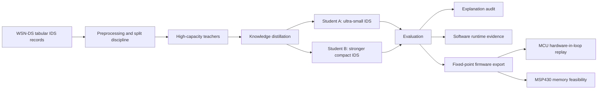
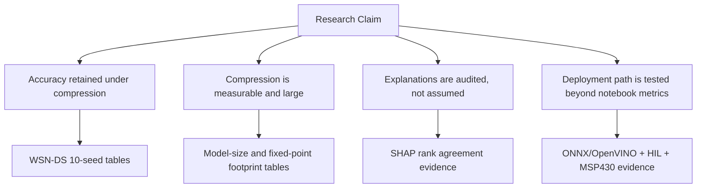

<div align="center">

# CuKD-XAI

### Resource-Aware Explainable Intrusion Detection Compression for WSN/IoT Security


**CuKD-XAI compresses high-performing intrusion-detection teachers into KB-scale neural students, then audits the resulting models for accuracy, class behavior, explanation alignment, software deployment readiness, and microcontroller replay feasibility.**

</div>

---

## At A Glance

| Item | Current evidence |
|---|---|
| Primary dataset | WSN-DS multiclass intrusion detection |
| Supporting dataset | Edge-IIoTset, used for robustness and literature-positioning support |
| Main compression point | RF teacher to Student A RF-KD: about 18,300x smaller by serialized size |
| Best compact WSN-DS point in README | Student B co-distillation: 0.989133 accuracy, 0.933526 macro-F1, 13.27 KB |
| Fixed-point firmware scope | Student A and Student B RF-KD exported to integer C/preprocessing artifacts |
| Hardware replay scope | 56,200 WSN-DS test vectors replayed on ESP32-C3 and Arduino R4 |
| Active artifact status | Evidence-preserved, smoke-tested, and path-audited for paper writing |

---

## Research Objective

Wireless sensor and IoT intrusion-detection models often report high accuracy, but many are too large or insufficiently deployment-audited for constrained devices. CuKD-XAI studies a practical question:

> Can a strong tabular IDS teacher be compressed into tiny neural students while retaining useful detection behavior and producing realistic deployment evidence?

The main experimental line uses **WSN-DS** multiclass intrusion detection. **Edge-IIoTset** is used as supporting robustness evidence, not as the main claim.

---

## What This Repository Contains

| Area | Evidence |
|---|---|
| Predictive compression | RF/MLP teachers distilled into compact Student A and Student B neural models |
| Co-distillation | Student-to-student refinement with consistency and ranking components |
| Explanation audit | SHAP-based teacher-student feature-rank comparison |
| Software deployment | ONNX export, OpenVINO execution, dynamic INT8 checks |
| Firmware deployment | Fixed-point C export with integer preprocessing metadata |
| Hardware validation | ESP32-C3 and Arduino R4 USB-serial hardware-in-loop replay |
| Mote feasibility | MSP430F1611/TelosB-class compile and memory-footprint evidence |
| Robustness support | Edge-IIoT strict and literature-comparable evaluation tracks |

---

## System View





---

## Main Results

### WSN-DS Model Compression

| Model | Accuracy | Macro-F1 | Size | Interpretation |
|---|---:|---:|---:|---|
| RF teacher | 0.996600 | 0.978889 | 85064.54 KB | High-performing reference teacher |
| Student A RF-KD | 0.986875 | 0.919971 | 4.64 KB | Ultra-small compressed IDS |
| Student B co-distillation | 0.989133 | 0.933526 | 13.27 KB | Stronger compact student |

Student A compresses the RF teacher by roughly **18,300x** by serialized size while retaining high weighted performance. Student B gives a stronger balanced-performance point with a still-small footprint.

### Fixed-Point Firmware Footprint

| Model | Architecture | MACs | Fixed-point parameter bytes |
|---|---:|---:|---:|
| Student A RF-KD | 17-32-16-5 | 1,136 | 1,348 B |
| Student B RF-KD | 17-64-32-5 | 3,296 | 3,700 B |

### Hardware-in-Loop Replay

| Model | Board | Vectors | MCU vs fixed reference | Accuracy | Macro-F1 | Mean total latency |
|---|---|---:|---:|---:|---:|---:|
| Student A RF-KD | ESP32-C3 | 56,200 | 1.000000 | 0.985623 | 0.914014 | 118.40 us |
| Student A RF-KD | Arduino R4 WiFi | 56,200 | 1.000000 | 0.985623 | 0.914014 | 301.63 us |
| Student B RF-KD | ESP32-C3 | 56,200 | 1.000000 | 0.986957 | 0.918099 | 332.33 us |
| Student B RF-KD | Arduino R4 WiFi | 56,200 | 1.000000 | 0.986957 | 0.918099 | 791.57 us |

Hardware replay validates the generated fixed-point model execution over saved WSN-DS feature vectors. It does **not** claim live packet capture or energy profiling.

---

## Evidence Index

| Evidence type | Location |
|---|---|
| Final WSN-DS tables and figures | [`results/wsnds/final_results/`](results/wsnds/final_results/) |
| Edge-IIoT support evidence | [`results/edge_iiot/`](results/edge_iiot/) |
| ONNX/OpenVINO runtime evidence | [`results/runtime/onnx_openvino/wsnds/`](results/runtime/onnx_openvino/wsnds/) |
| Hardware replay outputs | [`results/hardware_hil/board_replay/`](results/hardware_hil/board_replay/) |
| Final HIL tables | [`results/hardware_hil/reports/final_postprocessing/`](results/hardware_hil/reports/final_postprocessing/) |
| Compile footprint logs | [`results/hardware_hil/compile_logs/`](results/hardware_hil/compile_logs/) |
| Research evidence ledger | [`docs/research/RESULTS_AND_EVIDENCE.md`](docs/research/RESULTS_AND_EVIDENCE.md) |
| End-to-end technical brief | [`docs/research/PROJECT_TECHNICAL_BRIEF.md`](docs/research/PROJECT_TECHNICAL_BRIEF.md) |
| Literature comparison material | [`docs/literature/`](docs/literature/) |
| Artifact review guide | [`ARTIFACT.md`](ARTIFACT.md) |
| Citation metadata | [`CITATION.cff`](CITATION.cff) |
| License and data-use notice | [`LICENSE`](LICENSE), [`NOTICE.md`](NOTICE.md) |

---

## How To Review This Repository

| Reviewer goal | Recommended path |
|---|---|
| Understand the complete project before a technical discussion | Read [`docs/research/PROJECT_TECHNICAL_BRIEF.md`](docs/research/PROJECT_TECHNICAL_BRIEF.md), then this README |
| Check whether a claim is backed by evidence | Use [`docs/research/RESULTS_AND_EVIDENCE.md`](docs/research/RESULTS_AND_EVIDENCE.md) and the linked result files |
| Inspect final WSN-DS results | Start with [`results/wsnds/final_results/2026-05-30-10seed-plus-j/`](results/wsnds/final_results/2026-05-30-10seed-plus-j/) |
| Inspect deployment and hardware evidence | Start with [`results/hardware_hil/reports/final_postprocessing/`](results/hardware_hil/reports/final_postprocessing/) |
| Inspect Edge-IIoT support evidence | Start with [`results/edge_iiot/literature_metric_gap/`](results/edge_iiot/literature_metric_gap/) |
| Understand moved historical material | Read [`archive/README.md`](archive/README.md) and [`docs/repository/REPOSITORY_MAP.md`](docs/repository/REPOSITORY_MAP.md) |

---

## Reproducibility Status

| Layer | Status |
|---|---|
| Evidence inspection | Tracked reports, tables, figures, firmware bundles, and replay logs are present |
| Smoke tests | `pytest` and Python compile checks cover active repository structure and tooling |
| HIL post-processing | Regenerates from moved evidence under `results/hardware_hil/` |
| Edge-IIoT metric-gap post-processing | Regenerates from moved evidence under `results/edge_iiot/` |
| Full training rerun | Code is preserved, but full reruns are compute- and data-dependent |
| Docker image | Not included; this is a research artifact, not a containerized service |

---

## Repository Structure

```text
CuKD-XAI/
  data/          Dataset files and preserved dataset copies
  experiments/   Research experiment implementations
  results/       Paper-facing metrics, tables, figures, runtime outputs, and HIL evidence
  deployment/    Firmware export, hardware tooling, and embedded deployment assets
  docs/          Research briefs, literature notes, reproduction notes, and repository documentation
  tests/         Static, export, and hardware-HIL checks
  archive/       Preserved historical runs, old packages, and scratch outputs
```

The structure is intentionally separated by purpose: **experiments produce evidence**, **results preserve evidence**, **deployment holds deployable assets**, and **archive keeps historical material without polluting the active research surface**.

---

## Claim Boundaries

Supported by the current evidence:

- WSN-DS teacher-to-student compression with 10-seed metrics.
- Very large serialized-size reduction from RF teacher to neural students.
- SHAP-based explanation-rank audit showing that predictive compression does not automatically preserve explanation rankings.
- ONNX/OpenVINO software deployment checks.
- Fixed-point C export with integer preprocessing.
- ESP32-C3 and Arduino R4 hardware-in-loop replay over 56,200 WSN-DS test vectors.
- MSP430F1611/TelosB-class memory-feasibility compilation evidence.
- Edge-IIoT support experiments for robustness discussion.

Not claimed:

- Best WSN-DS accuracy.
- First use of SHAP/XAI for WSN or IoT IDS.
- Live WSN packet capture.
- Physical TelosB deployment.
- Energy or battery-life measurement.
- Full on-mote packet-to-feature extraction.

---

## Publication Positioning

The defensible novelty is not raw accuracy alone. The contribution is the combined evidence chain:

1. High-performing IDS teacher compressed into KB-scale students.
2. Compression evaluated across accuracy, macro-F1, per-class behavior, and model footprint.
3. Explanation behavior audited rather than assumed.
4. Software and firmware deployment paths tested with concrete evidence files.
5. MCU replay and MSP430 memory evidence used to narrow the gap between notebook results and constrained-device feasibility.

This makes the work stronger as a **resource-aware explainable IDS compression evidence package** than as a pure leaderboard paper.

---

## Citation

If citing this repository before a manuscript DOI is available, cite the repository and the evidence ledger:

```bibtex
@misc{cukd_xai_repository,
  title  = {CuKD-XAI: Resource-Aware Explainable IDS Compression for WSN/IoT Security},
  author = {Harkut, Nishant},
  year   = {2026},
  note   = {Research evidence package with WSN-DS, Edge-IIoT, ONNX/OpenVINO, fixed-point C, and hardware-in-loop evidence}
}
```
