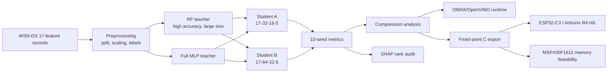
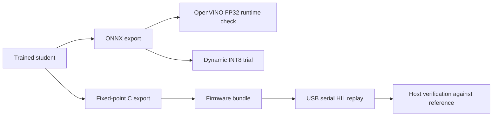

# CuKD-XAI README Rewrite Blueprint

## Goal

Replace the current quick-start-only README with a professional research repository README. The README should make the repository look like a serious, reproducible research evidence package while staying factual and conservative.

## README Principles

- Lead with the research contribution, not Colab setup.
- Show the whole pipeline visually.
- Make the compression result obvious.
- Separate software deployment from embedded/HIL evidence.
- Make limitations explicit.
- Link to evidence files instead of restating every number.
- Avoid unsupported claims such as best WSN-DS accuracy, first SHAP, physical TelosB deployment, live packet capture, energy measurement, or INT8 speedup.

## Proposed README Structure

```markdown
# CuKD-XAI: Compressing Explainable WSN Intrusion Detection for Edge Deployment

[badges]

One-paragraph abstract.

## Highlights
## Key Results
## Architecture
## Repository Layout
## Evidence Index
## Reproduction Notes
## Deployment Evidence
## Edge-IIoT Generalization
## Literature Positioning
## Claim Boundaries
## Citation
## License
## Acknowledgements
```

## Recommended Badges

Use Shields.io badges. These are visual tags without unsupported claims.

```markdown


```

Do not add a "SOTA" badge.

## Opening Abstract Draft

```markdown
CuKD-XAI studies whether a high-performing WSN-DS intrusion-detection teacher can be compressed into KB-scale neural students while preserving useful multiclass detection performance. The project evaluates RF-to-student knowledge distillation, co-distillation, SHAP-based explanation-faithfulness, ONNX/OpenVINO software export, fixed-point C generation, MCU hardware-in-loop replay on ESP32-C3 and Arduino R4, and MSP430F1611 memory-feasibility compilation. The work is positioned as a resource-aware and explanation-audited IDS compression pipeline, not as a WSN-DS accuracy-leaderboard claim.
```

## Highlights Section

```markdown
## Highlights

- WSN-DS multiclass IDS pipeline with 10-seed evaluation.
- RF teacher: 0.9966 accuracy, 0.9789 macro-F1, about 85064.54 KB.
- Student A: 17-32-16-5, 4.64 KB, 0.986875 accuracy, 0.919971 macro-F1.
- Student B: 17-64-32-5, 13.27 KB, 0.989133 accuracy, 0.933526 macro-F1.
- Fixed-point RF-KD HIL replay matched generated fixed-point references across 56,200 vectors on ESP32-C3 and Arduino R4.
- SHAP teacher-student rank agreement is low, showing prediction transfer does not guarantee explanation transfer.
- Edge-IIoT is included as secondary generalization/stress evidence.
```

## Architecture Diagram

Use Mermaid so GitHub renders it natively.

```markdown

```

## Deployment Boundary Diagram

```markdown

```

Then state:

```markdown
ONNX/OpenVINO are software deployment checks. Fixed-point C and HIL replay are the MCU-facing evidence. The current project does not claim live WSN packet capture, physical TelosB deployment, or energy measurement.
```

## Key Results Table

```markdown
| Model | Accuracy | Macro-F1 | Size | Role |
|---|---:|---:|---:|---|
| RF teacher | 0.996600 | 0.978889 | 85064.54 KB | High-performing teacher |
| Student A RF-KD | 0.986875 | 0.919971 | 4.64 KB | Ultra-small student |
| Student B co-distill | 0.989133 | 0.933526 | 13.27 KB | Stronger compressed student |
| Student A fixed-point params | n/a | n/a | 1348 B | Firmware model footprint |
| Student B fixed-point params | n/a | n/a | 3700 B | Firmware model footprint |
```

Link the table to:

- `docs/research/RESULTS_AND_EVIDENCE.md`
- `results/hardware_hil/reports/final_postprocessing/final_postprocessing_analysis.md`

## Repository Layout Section

After restructure, README should show:

```markdown
| Path | Purpose |
|---|---|
| `experiments/wsnds/` | Main WSN-DS training, KD, co-distillation, and runtime implementations. |
| `experiments/edge_iiot/` | Secondary Edge-IIoT generalization and literature-comparable implementations. |
| `deployment/hardware_hil/` | Firmware HIL host tools, board bundles, and runbooks. |
| `deployment/msp430/` | MSP430F1611 memory-feasibility evidence. |
| `results/` | Generated result tables, runtime evidence, HIL outputs, and historical outputs. |
| `docs/research/` | Technical brief, evidence ledger, and related-work comparison. |
| `docs/publication/` | Manuscript preparation and writing guidance. |
| `docs/literature/` | Papers and comparison material. |
| `research_history/` | Preserved historical runs, old notebooks, and scratch outputs. |
```

## Reproducibility Section

Keep commands short and honest. Do not make one command imply full hardware reproduction.

```markdown
### WSN-DS training

Open `experiments/wsnds/main/cukd_xai_colab.ipynb` or run the Python export if the local environment has the required dependencies and dataset path.

### Runtime evidence

Run the deployment/runtime scripts under `experiments/wsnds/deployment_runtime/`.

### Hardware HIL

Follow `deployment/hardware_hil/docs/00_READ_THIS_FIRST.md`.
```

## Claim Boundaries Section

```markdown
## Claim Boundaries

Supported:

- WSN-DS RF-to-student compression with 10-seed metrics.
- SHAP teacher-student feature-rank audit.
- ONNX/OpenVINO software runtime checks.
- Fixed-point C export and replay.
- ESP32-C3 and Arduino R4 HIL replay of saved WSN-DS vectors.
- MSP430F1611 memory-feasibility compilation.

Not claimed:

- Best WSN-DS accuracy.
- First SHAP/XAI use on WSN-DS.
- Live WSN packet capture.
- Physical TelosB deployment.
- Energy or battery-life measurement.
- INT8 speedup.
```

## README Rewrite Tasks

- [ ] Replace the current title and quick-start introduction.
- [ ] Add badges.
- [ ] Add one-paragraph abstract.
- [ ] Add Highlights.
- [ ] Add Key Results table.
- [ ] Add Mermaid architecture diagram.
- [ ] Add Mermaid deployment boundary diagram.
- [ ] Add Repository Layout table after restructure.
- [ ] Add concise evidence and reproduction pointers with current paths.
- [ ] Add Reproducing Results section.
- [ ] Add Deployment Evidence section.
- [ ] Add Edge-IIoT Generalization section.
- [ ] Add Literature Positioning section.
- [ ] Add Claim Boundaries section.
- [ ] Add Citation section.
- [ ] Add License section only if a license file exists or is added deliberately.

## README Verification

- [ ] Run markdown table check.
- [ ] Click/open every local path.
- [ ] Search unsupported claims:
  ```powershell
  rg -n "best accuracy|SOTA|first SHAP|deployed on TelosB|energy measured|INT8 speedup" README.md
  ```
  Expected: matches only inside "Not claimed" if present.

- [ ] Confirm Mermaid blocks render on GitHub after PR preview.

## Review Rule

The README should look strong because the evidence is strong, not because the language overclaims. The professional standard is clear scope, reproducible paths, and honest boundaries.
