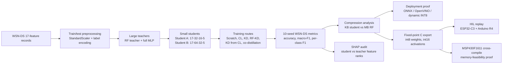
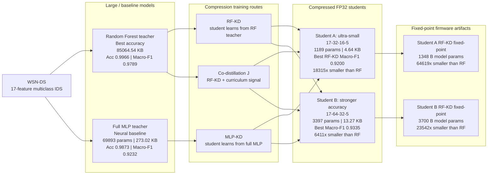
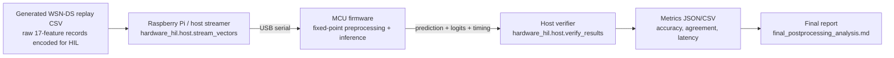

# CuKD-XAI End-to-End Technical Brief

> **Historical synthesis:** This brief predates the finalized ten-seed
> feature-group-disjoint evidence and final USB campaign. Its 56,200-row and
> May-result references document earlier lineages. Current claims and values
> are defined by
> `results/evidence_registry/fgds_20260814_current/EVIDENCE_REGISTRY.md`.

This document is a discussion guide for explaining the complete CuKD-XAI project end to end. All paths are relative to the repository root. Numeric claims are backed by the result files cited inline and summarized in `docs/research/RESULTS_AND_EVIDENCE.md`.

## One-Minute Thesis

CuKD-XAI is not an accuracy-leaderboard project. The main contribution is compressing a high-performing WSN-DS multiclass intrusion detector into KB-scale neural students while preserving useful detection performance, then auditing whether the compressed students preserve the teacher's feature-importance reasoning and validating the fixed-point inference path on available MCU-class boards.

The safest project sentence is:

> CuKD-XAI compresses a high-performing WSN-DS intrusion detector into KB-scale students, validates the compressed inference path through software runtime, fixed-point C, and hardware-in-loop replay, and shows that predictive distillation does not automatically preserve teacher SHAP feature ranking.

Primary source files:

| Area | Source files |
|---|---|
| WSN-DS model training and SHAP | `experiments/wsnds/main/cukd_xai_colab.py`, `results/wsnds/final_results/2026-05-30-10seed-plus-j/wsnds_results_student_A.csv`, `results/wsnds/final_results/2026-05-30-10seed-plus-j/wsnds_results_student_B.csv`, `results/wsnds/legacy_runs/2026-05-30-10seed/cukd_xai_results.json` |
| Co-distillation | `experiments/wsnds/codistillation/cukd_xai_wsnds_j_only_merge.py`, `results/wsnds/final_results/2026-05-30-10seed-plus-j/j_only_results.json` |
| Deployment runtime | `experiments/wsnds/deployment_runtime/cukd_xai_wsnds_deployment_qat_proof.py`, `experiments/wsnds/deployment_runtime/cukd_xai_wsnds_runtime_from_existing.py`, `results/runtime/onnx_openvino/wsnds/runtime_from_existing_outputs/wsnds_existing_artifact_runtime_summary.csv` |
| Fixed-point C and MSP430 | `deployment/msp430/MSP430_CROSS_COMPILE_REPORT.md`, `deployment/msp430/msp430_build_v2/` |
| Hardware HIL replay | `deployment/hardware_hil/host/`, `results/hardware_hil/reports/final_postprocessing/final_postprocessing_analysis.md` |
| Edge-IIoT stress/generalization | `experiments/edge_iiot/strict_generalization/cukd_xai_edgeiiot_v23_generalization.py`, `experiments/edge_iiot/literature_comparable/cukd_xai_edgeiiot_v23_literature_comparable.py` |
| Related work positioning | `docs/research/RELATED_WORK_RESULTS_COMPARISON.md`, `docs/literature/comparison_tables/EDGEIIOT_LITERATURE_COMPARISON.md` |

## End-to-End Pipeline



### What Happens at Each Stage

1. **Data and preprocessing**
   - The core WSN-DS route uses 17 tabular features and multiclass labels.
   - The Python pipeline performs train/test splitting, scaling, and label handling before training.
   - Main code reference: `experiments/wsnds/main/cukd_xai_colab.py`.

2. **Teacher training**
   - The strongest WSN-DS teacher is the Random Forest (`A_RF_500`).
   - It reaches `0.9966` accuracy and `0.9789` macro-F1 across 10 seeds, but its serialized size is about `85064.54 KB`.
   - Source: `results/wsnds/final_results/2026-05-30-10seed-plus-j/wsnds_results_student_A.csv` and `wsnds_results_student_B.csv`.

3. **Student compression**
   - Student A: `17-32-16-5`, `1,189` params, `4.64 KB` FP32.
   - Student B: `17-64-32-5`, `3,397` params, `13.27 KB` FP32.
   - Student A is the ultra-small deployment story; Student B is the stronger accuracy-compression story.

4. **Training variants**
   - Scratch small MLP: direct supervised training.
   - Curriculum learning: loss/domain pacing variants.
   - KD from RF: student learns from RF soft labels/probabilities.
   - KD from MLP or CL-MLP: student learns from neural teacher variants.
   - Co-distillation `J`: combines RF-KD and curriculum-style signals.

5. **Explainability audit**
   - SHAP is used to compare student and teacher feature-importance rankings.
   - The important result is not "we used SHAP"; the important result is that the compressed student has useful prediction performance but low teacher-student global SHAP rank agreement.
   - Source summary: `docs/research/RELATED_WORK_RESULTS_COMPARISON.md`; raw SHAP block: `results/wsnds/legacy_runs/2026-05-30-10seed/cukd_xai_results.json`.

6. **Deployment proof**
   - Software deployment route exports/evaluates ONNX and OpenVINO artifacts.
   - Dynamic INT8 reduces artifact size for some models, but current evidence does not support an INT8 speedup claim.
   - Source: `results/runtime/onnx_openvino/wsnds/runtime_from_existing_outputs/wsnds_existing_artifact_runtime_summary.csv`.

### Deployment Terms in Plain Language

| Term | Meaning in this project | What it proves | What it does not prove |
|---|---|---|---|
| ONNX | Open Neural Network Exchange; a portable file format for exporting trained neural models outside PyTorch. | The trained student can be exported as a standard software inference artifact and run outside the original training code. | It is not a microcontroller firmware format and does not prove physical WSN deployment. |
| OpenVINO | Intel's optimized inference/runtime toolkit. Here it is used to check that the ONNX-exported student can also run through another deployment runtime. | OpenVINO FP32 preserved ONNX predictions in the reported runs, giving an extra software-runtime consistency check. | It does not prove embedded MCU speedup or TelosB deployment. |
| Dynamic INT8 | Post-training quantization where some model operations/weights are represented with 8-bit integers by the runtime exporter. | It reduced artifact size for some ONNX models. | In the current evidence it reduced macro-F1 and does not support an INT8 speedup claim. |
| Fixed-point C | A separate firmware-oriented path where weights/preprocessing are converted into integer C code for MCU-class replay. | This is the path used for ESP32-C3, Arduino R4, and MSP430F1611 memory-feasibility evidence. | It still consumes already extracted WSN-DS tabular features; it is not live packet capture. |
| HIL replay | Hardware-in-loop replay: the host sends saved WSN-DS test vectors to real MCU firmware over serial and verifies returned predictions/logits/timing. | It proves the fixed-point firmware path runs on available MCU-class boards and matches the generated fixed-point reference. | It is not physical TelosB radio deployment or energy measurement. |

7. **Fixed-point C and HIL**
   - RF-KD students are exported to fixed-point C.
   - HIL tests replay the 56,200 WSN-DS test vectors over USB serial to ESP32-C3 and Arduino R4 firmware.
   - The MCU output is checked against generated fixed-point reference predictions and FP32 predictions.
   - Source: `results/hardware_hil/reports/final_postprocessing/final_postprocessing_analysis.md`.

8. **MSP430/TelosB-class memory feasibility**
   - The Student A fixed-point core cross-compiles for MSP430F1611.
   - This is memory-feasibility evidence only. It is not physical TelosB deployment, energy measurement, radio integration, or live feature extraction.
   - Source: `deployment/msp430/MSP430_CROSS_COMPILE_REPORT.md`.

9. **Edge-IIoT extension**
   - Edge-IIoT is used as a stress/generalization check.
   - The strict route intentionally removes leakage/identifier/source/payload-style columns and is much harder.
   - The literature-comparable selected-capacity route shows stronger numbers and allows cautious literature comparison.
   - Sources: `results/edge_iiot/strict_generalization/`, `results/edge_iiot/literature_comparable/`, and `docs/literature/comparison_tables/EDGEIIOT_LITERATURE_COMPARISON.md`.

## Model and Compression Structure

Read this diagram from left to right: start with the high-accuracy but large teacher, train small students using KD/co-distillation routes, then export the RF-KD students into fixed-point firmware artifacts.



Compression facts from current artifacts:

| Comparison | Ratio |
|---|---:|
| Student A FP32 vs RF teacher | about `18,315x` smaller |
| Student B FP32 vs RF teacher | about `6,411x` smaller |
| Student A fixed-point params vs RF teacher | about `64,619x` smaller |
| Student B fixed-point params vs RF teacher | about `23,542x` smaller |

Source: `results/wsnds/final_results/2026-05-30-10seed-plus-j/wsnds_results_student_A.csv`, `results/wsnds/final_results/2026-05-30-10seed-plus-j/wsnds_results_student_B.csv`, `results/hardware_hil/reports/final_postprocessing/model_only_footprint.csv`.

## Hardware and Deployment Boundary



Boundary to state clearly:

| Supported by evidence | Not supported yet |
|---|---|
| Fixed-point C inference core | Live WSN packet capture |
| Integer StandardScaler metadata after raw features exist | Packet-to-feature extraction on mote |
| ESP32-C3 and Arduino R4 USB replay HIL | Physical TelosB latency/energy |
| MSP430F1611 target-toolchain memory feasibility | Full TinyOS/Contiki/RIOT integration |
| ONNX/OpenVINO software runtime artifact checks | INT8 speedup claim |

## Code Walkthrough Order

Use this order during a technical review of the code:

1. `experiments/wsnds/main/cukd_xai_colab.py`
   - Shows imports, `TeacherMLP`, `StudentMLP`, training functions, KD function, quantization helper, RF teacher, run loop, SHAP section, and result export.

2. `results/wsnds/final_results/2026-05-30-10seed-plus-j/wsnds_results_student_A.csv` and `wsnds_results_student_B.csv`
   - Show the 10-seed evidence for the full WSN-DS result table.

3. `experiments/wsnds/codistillation/cukd_xai_wsnds_j_only_merge.py`
   - Shows how the co-distillation result was integrated into the existing result set.

4. `experiments/wsnds/deployment_runtime/cukd_xai_wsnds_deployment_qat_proof.py`
   - Shows the deployment-oriented proof and export route.

5. `experiments/wsnds/deployment_runtime/cukd_xai_wsnds_runtime_from_existing.py`
   - Shows the runtime evaluation from existing artifacts without retraining.

6. `deployment/firmware_export/wsnds_rfkd_hil/export_wsnds_student_a_rfkd_int8.py`
   - Shows fixed-point C export logic and generated headers.

7. `deployment/hardware_hil/host/stream_vectors.py`
   - Shows how vectors are streamed to the MCU over serial.

8. `deployment/hardware_hil/host/verify_results.py`
   - Shows how MCU output is compared against reference predictions.

9. `experiments/edge_iiot/strict_generalization/cukd_xai_edgeiiot_v23_generalization.py`
   - Shows the strict Edge-IIoT route.

10. `experiments/edge_iiot/literature_comparable/cukd_xai_edgeiiot_v23_literature_comparable.py`
    - Shows the selected-capacity literature-comparable Edge-IIoT route.

## Related-Work Positioning

The safest related-work framing is:

| Literature direction | How CuKD-XAI should be positioned |
|---|---|
| WSN-DS accuracy-SOTA tree/ensemble papers | They report higher accuracy/F1. CuKD-XAI should not claim accuracy SOTA; it trades some macro-F1 for very large compression. |
| WSN-DS SHAP/XAI papers | They already use SHAP. CuKD-XAI should claim explanation-faithfulness auditing after compression, not first SHAP use. |
| Lightweight IoT/KD IDS papers | They show that compression/KD is active in IDS, but often on other datasets. CuKD-XAI's angle is WSN-DS multiclass compression plus deployment proof. |
| Edge-IIoT papers | Comparisons are protocol-sensitive. Use the literature-comparable Edge-IIoT report and avoid direct macro-F1 comparisons when papers do not define F1 averaging. |

Source files:

- `docs/research/RELATED_WORK_RESULTS_COMPARISON.md`
- `docs/literature/comparison_tables/EDGEIIOT_LITERATURE_COMPARISON.md`

For exact paper-by-paper numbers, open `docs/research/RESULTS_AND_EVIDENCE.md` and use the section **Verified Base and Related-Paper Comparison**. That table separates the paper-reported result, our closest comparable result, and the scope-aware interpretation.

## Research Discussion Brief

His Mamba/channel-prediction paper style is direct: first define the domain need, then the technical gap, then the proposed method, then quantified results, then limitations. Use that same structure instead of starting with every experiment detail.

### Opening If He Says "Now Tell Me the Project Properly"

```text
Sir, the main idea is not to beat the WSN-DS accuracy leaderboard. WSN-DS already has very strong RF, CatBoost, and ensemble papers around 99.65 to 99.94 percent accuracy. Our gap is different: those strong models are usually large or not fully deployment-audited. CuKD-XAI asks whether we can compress a strong WSN-DS teacher into KB-scale neural students, check the accuracy-compression trade-off, verify the fixed-point execution path on MCU-class boards, and audit whether the student's SHAP explanation ranking still matches the teacher.
```

Then continue:

```text
The strongest teacher is the RF model with 99.66 percent accuracy and 97.89 percent macro-F1, but it is about 85 MB. Student A is only 4.64 KB and reaches 98.69 percent accuracy and 92.00 percent macro-F1. Student B is 13.27 KB and reaches about 98.91 percent accuracy and 93.35 percent macro-F1. So the central result is a very large compression gain with bounded loss in macro-F1, plus deployment-path evidence through ONNX/OpenVINO, fixed-point C, ESP32-C3 and Arduino R4 HIL replay, and MSP430F1611 memory-feasibility compilation.
```

### If He Asks "What Is the Novelty?"

Say this:

```text
The novelty is the combined evidence chain, not any single component alone. KD exists, SHAP exists, and WSN-DS accuracy papers exist. Our contribution is RF-to-neural-student compression on WSN-DS, multi-seed accuracy/macro-F1 analysis, explanation-faithfulness audit after compression, and deployment-path validation from software runtime to fixed-point C and MCU HIL replay.
```

If he pushes harder:

```text
The paper should be written as a resource-aware and explanation-audited IDS compression paper. It should not be written as a pure SOTA-accuracy paper.
```

### If He Asks "How Does It Compare With Base Papers?"

Use this short table verbally, then open `docs/research/RESULTS_AND_EVIDENCE.md` for exact sources. The evidence file now has two comparison layers:

1. **Direct WSN-DS / WSN competitors:** original WSN-DS, Talukder, MLSTL-WSN, Birahim, Pandey, GSWO-CatBoost, Alfarra, Xiao, Vidhya, Rana, Salmi.
2. **Broader XAI/KD/IoT IDS landscape:** Benaddi, Hossain, Okey RAID-KL, DistillGuard, IEEE TCE KD, SHAP/LIME/attention/rule-induction papers, and XAI survey papers.

| Comparator type | Example paper result | Our result | What to say |
|---|---:|---:|---|
| Original WSN-DS baseline | Almomani 2016 introduced WSN-DS; older ANN baseline around `96.6%` accuracy in repo context | Student B `98.91%` accuracy, `93.35%` macro-F1 | We use WSN-DS as the benchmark; our contribution is compression and evidence chain, not dataset creation. |
| Top WSN-DS RF/PCA/balancing | Talukder 2025 KMS+PCA+RFC: `99.94%` accuracy/F1 | Student B `98.91%` accuracy, `93.35%` macro-F1, `13.27 KB` | They are stronger in raw accuracy; our differentiator is compression and deployment evidence. |
| WSN-DS SMOTE-Tomek RF | MLSTL-WSN: `99.92%` multiclass accuracy | Student A `4.64 KB`, Student B `13.27 KB` | They show strong RF-style WSN-DS accuracy; our question is whether a tiny student can retain useful performance. |
| WSN-DS PSO explainable ensemble | Birahim 2025: `99.73%` accuracy, `99.72%` F1 | SHAP rank Spearman about `0.0466`; HIL replay agreement `1.0` vs fixed reference | They already use SHAP/LIME, so our XAI claim must be explanation-transfer audit after compression. |
| WSN-DS GSWO-CatBoost | `99.65%` accuracy, `97.47%` F1, `16 ms` inference table value | Student B `13.27 KB`; fixed-point Student B `3700 B` model params | They are strong and fast; our size/HIL/MSP430 evidence is the differentiator. |
| Energy-aware WSN hybrid | Alfarra 2025: `98%` accuracy, `0.93` macro-F1, `42 ms`, T50 `69 days` | Student B `98.91%` accuracy, `0.9335` macro-F1; no energy measurement | They are stronger on energy/lifetime realism. We should honestly state energy is future work. |
| Binarized WSN-DS compression | Vidhya 2026: 5-class BSCNN, abstract gives relative accuracy gains, absolute size not verified | Student A/B have verified KB-scale sizes and HIL evidence | This invalidates "first compression on WSN-DS"; our angle is KD compression and verified deployment chain. |
| KD/XAI compression IDS | Benaddi 2025 TON-IoT: student `0.9968` accuracy, `0.9863` macro-F1, `22.29 KB` | WSN-DS Student B `13.27 KB`; Edge-IIoT Student C `61.06 KB` | Very relevant related work, but different dataset and structure. Our WSN-DS/HIL/MSP430 chain is distinct. |

If he asks why so many papers are not in the verbal table, say:

```text
Sir, I separated the comparison into direct WSN-DS competitors and broader XAI/KD/IoT IDS context. The direct WSN-DS papers decide the performance-positioning claim. The broader papers show that SHAP, LIME, KD, attention, and rule induction are already active, so our novelty has to be framed as the WSN-DS-specific compression plus deployment and explanation-faithfulness evidence chain.
```

### If He Asks "Then Why Is This Publishable?"

Use this answer:

```text
Because the paper is not claiming that a tiny student is more accurate than optimized RF/CatBoost papers. It claims that a strong teacher can be compressed into KB-scale students with useful WSN-DS performance, and that the deployment path is verified more deeply than a normal CSV-only ML paper. It also exposes a non-obvious finding: prediction behavior can transfer while SHAP feature-ranking behavior does not.
```

### If He Asks "What Is the Weakest Part?"

Be direct:

```text
The weakest part is that we do not have physical TelosB/live-packet/energy evidence yet. The hardware evidence is HIL replay on ESP32-C3 and Arduino R4 plus MSP430F1611 cross-compile memory feasibility. So the paper should not claim full WSN mote deployment. It should claim firmware-level fixed-point replay and memory feasibility.
```

### If He Asks "What Should Be the Paper Direction?"

Use this structure:

1. **Title direction:** compressed, deployable, explainable WSN IDS using knowledge distillation.
2. **Main gap:** high WSN-DS accuracy exists, but compressed and explanation-audited deployment evidence is less complete.
3. **Method:** RF teacher -> Student A/B MLPs -> KD/co-distillation -> SHAP alignment audit -> deployment export -> fixed-point/HIL.
4. **Main result:** Student A `4.64 KB` and Student B `13.27 KB` with useful macro-F1, thousands of times smaller than the RF teacher.
5. **Hardware result:** fixed-point HIL replay matches generated fixed-point reference across all `56,200` vectors on both boards.
6. **Limitation:** not physical TelosB, no live feature extraction, no energy.

### One-Sentence Paper Claim

Use this exact style:

```text
This work demonstrates that WSN-DS intrusion detection can be compressed from an 85 MB RF teacher into KB-scale neural students with bounded accuracy loss, while fixed-point replay and SHAP-rank auditing reveal both deployment feasibility and explanation-transfer limitations.
```

## What to Emphasize in the Meeting

1. The main contribution is compression and deployability, not raw SOTA accuracy.
2. The RF teacher is very strong but too large for constrained deployment.
3. Student A and Student B provide two publishable operating points:
   - Student A: ultra-small, strongest embedded-footprint story.
   - Student B: better accuracy-compression point.
4. SHAP alignment being low is a finding, not a failure: it shows that predictive distillation does not guarantee explanation-faithfulness.
5. Hardware evidence is bounded and honest: HIL replay on ESP32-C3/Arduino R4 plus MSP430 memory feasibility, not full WSN mote deployment.
6. Edge-IIoT is useful as generalization/stress evidence but should not distract from the WSN-DS compression core.

## Claims to Avoid

- Do not claim best WSN-DS accuracy.
- Do not claim first SHAP on WSN-DS.
- Do not claim physical TelosB deployment.
- Do not claim live packet capture or on-mote packet-to-feature extraction.
- Do not claim energy measurement.
- Do not claim INT8 speedup from the current runtime evidence.
- Do not claim co-distillation always improves.

## Review Questions and Evidence-Based Answers

Use these as spoken answers. Keep them factual and bounded; do not add claims that are not in the evidence files.

### Basic Project Questions

| Question | Safe answer |
|---|---|
| What is this project about in one sentence? | It compresses a high-performing WSN-DS multiclass intrusion detector into KB-scale student models and checks whether the compressed models remain deployable and explanation-faithful. |
| What problem are you solving? | Large IDS models can be accurate but difficult to deploy on constrained WSN/IoT devices. The project studies the accuracy-compression-deployment trade-off. |
| What is WSN-DS? | WSN-DS is a wireless sensor network intrusion detection dataset with LEACH-related traffic features and attack classes. In this project it is used as a multiclass IDS benchmark. |
| What is the input to the model? | The WSN-DS route uses already extracted tabular records with 17 features. The current hardware path does not extract features from live packets. |
| What are the output classes? | The project treats WSN-DS as a multiclass classification task covering Normal and attack classes such as Blackhole, Grayhole, Flooding, and TDMA. |
| What is a teacher model here? | A teacher is a stronger model used to train or guide a smaller student. The key teacher is the RF model, which has high performance but large serialized size. |
| What is a student model here? | A student is a small MLP that tries to preserve useful teacher behavior with far fewer parameters and much smaller size. |
| Why are there Student A and Student B? | They are two capacity points. Student A is the ultra-small model; Student B is larger but gives better accuracy and macro-F1. |
| What is Student C? | Student C is used in the Edge-IIoT selected-capacity extension. It is not the main WSN-DS hardware result; it helps study whether more capacity improves Edge-IIoT performance. |
| What should I say is the main contribution? | Compression and deployability, plus explanation-faithfulness analysis. Do not frame the project as pure accuracy SOTA. |

### Method Questions

| Question | Safe answer |
|---|---|
| What is knowledge distillation? | KD trains a small student using information from a stronger teacher, instead of only using hard labels. Here the important route is RF-KD. |
| Why distill from Random Forest? | The RF teacher gives the strongest WSN-DS accuracy/macro-F1 but is too large. RF-KD is used to transfer useful decision behavior into KB-scale students. |
| What is curriculum learning in this project? | Curriculum learning is tested as a training strategy that changes the order or weighting of samples. It is part of the ablation set, but it is not the strongest final story. |
| What is co-distillation `J`? | `J_CoDistill_RF_CL` combines RF-KD with a curriculum-related signal. It gives the best Student B mean macro-F1, but RF-KD remains simpler and nearly as strong. |
| Why not only train a small MLP from scratch? | Scratch students are already compact, but RF-KD improves the main WSN-DS Student A and Student B results over scratch. |
| What preprocessing is used? | The Python route uses train/test preprocessing such as scaling and label encoding. The fixed-point route exports integer StandardScaler metadata for replay after raw tabular features already exist. |
| Why use macro-F1 along with accuracy? | WSN-DS is class-imbalanced. Accuracy can be dominated by majority classes, while macro-F1 shows how well minority classes are handled. |
| What does model size mean in the tables? | For FP32 students it is parameter storage size from the result CSVs. For firmware, model-only fixed-point footprint counts int8 weights and int32 biases reported in the HIL post-processing files. |
| Why do some deployment artifact sizes differ from FP32 parameter size? | ONNX/OpenVINO artifacts include serialization/framework overhead, so they are slightly different from raw parameter storage. |

### WSN-DS Results Questions

| Question | Safe answer |
|---|---|
| What is the RF teacher result? | The RF teacher reaches about `0.9966` accuracy and `0.9789` macro-F1, with serialized size about `85064.54 KB`. |
| What is the best ultra-small student? | Student A `E_KD_from_RF`: `0.986875` accuracy, `0.919971` macro-F1, `4.64 KB`. |
| What is the strongest Student B result? | Student B `J_CoDistill_RF_CL`: `0.989133` accuracy, `0.933526` macro-F1, `13.27 KB`. Student B RF-KD is very close at `0.932808` macro-F1. |
| How much accuracy is lost compared with RF? | The students are below the RF teacher, especially in macro-F1, but they reduce the model size by thousands of times. That is the intended trade-off. |
| Is Student B better than Student A? | For accuracy and macro-F1, yes. For extreme footprint, Student A is stronger because it is much smaller. |
| Should the paper headline Student A or Student B? | Use both: Student A for ultra-small embedded compression, Student B for the stronger accuracy-compression point. |
| Did co-distillation always improve? | No. It is best for Student B mean macro-F1, but RF-KD is often nearly as good and simpler. |
| Is this better than WSN-DS SOTA? | No. Several tree/ensemble papers report higher WSN-DS accuracy/F1. CuKD-XAI should be positioned around compression, deployment, and explanation audit. |

### Compression Questions

| Question | Safe answer |
|---|---|
| What is the main compression number? | Student A FP32 is about `18,315x` smaller than the RF teacher; Student B FP32 is about `6,411x` smaller. |
| What are the fixed-point model-only footprints? | Student A RF-KD uses `1348 B` model params; Student B RF-KD uses `3700 B` model params. |
| Why is compression so large? | The RF teacher stores many tree structures, while the students are small dense MLPs with a few thousand or fewer parameters. |
| Is the fixed-point footprint the full firmware size? | No. It is model-only parameter storage. Compile footprint includes Arduino framework and program overhead, which is reported separately. |
| Why does this matter for WSN motes? | WSN motes have tight memory limits. The cross-compile result shows the model core can fit in MSP430F1611-class memory, although physical deployment is still future work. |

### XAI and SHAP Questions

| Question | Safe answer |
|---|---|
| Why did you use SHAP? | SHAP is used to compare whether the compressed student preserves the teacher's feature-importance ranking. |
| What is the SHAP result? | Teacher-student global SHAP rank Spearman rho is about `0.0466`, with p-value `0.8591`; the rank agreement is near zero. |
| Is low SHAP agreement bad? | It is not a prediction failure. It means the student can preserve useful classification behavior without preserving the teacher's explanation ranking. |
| Is this the first SHAP work on WSN-DS? | No. Do not claim that. The contribution is explanation-faithfulness auditing after compression. |
| How should this be written in a paper? | "Predictive distillation preserved useful accuracy but did not preserve teacher feature-importance ordering." |

### Deployment and Hardware Questions

| Question | Safe answer |
|---|---|
| What did the ONNX/OpenVINO part prove? | It proves the trained students can be exported and run as software deployment artifacts. OpenVINO FP32 preserved ONNX predictions in the reported runs. |
| Did dynamic INT8 help? | It reduced artifact size for some models but lowered macro-F1 and did not support a speedup claim in the current CPU runtime evidence. |
| What is fixed-point C export? | The trained RF-KD student is converted into dependency-free C using int8 weights, int32 biases, and int16 activations, with integer preprocessing metadata. |
| What is HIL replay? | The host sends held-out WSN-DS replay vectors to firmware over USB serial; the MCU returns predictions/timings; the host verifies them against reference outputs. |
| Which boards were used for HIL? | ESP32-C3 DevKitM-1 and Arduino R4 WiFi. |
| What did HIL prove? | For all 56,200 replay vectors, MCU predictions matched the generated fixed-point reference with agreement `1.0` for both Student A and Student B on both boards. |
| Is this live IDS traffic? | No. It is replay of already extracted WSN-DS tabular records. |
| Did you deploy on TelosB? | No. The project has MSP430F1611 cross-compile memory-feasibility evidence, not physical TelosB deployment. |
| What did the MSP430 cross-compile prove? | The Student A fixed-point core links for MSP430F1611 with about `2,842 B` text, `0 B` data, and `6 B` bss in the smoke firmware. This supports memory feasibility only. |
| Did you measure energy? | No. Energy and battery-life measurement remain future work. |

### Edge-IIoT Questions

| Question | Safe answer |
|---|---|
| Why is Edge-IIoT included? | It checks whether the approach generalizes beyond WSN-DS and exposes how dataset protocol and model capacity affect results. |
| Why are strict Edge-IIoT results lower? | The strict route removes leakage-prone/identifier/source/payload-style columns and uses a hard 15-class setting, so it is intentionally more difficult. |
| What is the best Edge-IIoT selected-capacity student? | Student C RF-KD reaches about `0.9685` accuracy and `0.8244` macro-F1 at `61.06 KB`. |
| Should Edge-IIoT be the main paper story? | No. It is supporting generalization/stress evidence. The main story is WSN-DS compression and deployability. |
| Can we compare Edge-IIoT numbers directly to every paper? | No. Many papers differ in labels, leakage handling, features, and F1 averaging. Use the dedicated Edge-IIoT comparison doc carefully. |

### Code and Evidence Questions

| Question | Safe answer |
|---|---|
| Where is the main training code? | `experiments/wsnds/main/cukd_xai_colab.py` contains the main WSN-DS teacher/student, KD, curriculum, SHAP, and result-export pipeline. |
| Where are the final WSN-DS results? | `results/wsnds/final_results/2026-05-30-10seed-plus-j/wsnds_results_student_A.csv` and `wsnds_results_student_B.csv`. |
| Where is hardware evidence? | `results/hardware_hil/reports/final_postprocessing/final_postprocessing_analysis.md` and its companion CSV files. |
| Where is MSP430 evidence? | `deployment/msp430/MSP430_CROSS_COMPILE_REPORT.md`. |
| Where is Edge-IIoT evidence? | Strict route: `results/edge_iiot/strict_generalization/`; selected-capacity route: `results/edge_iiot/literature_comparable/`. |
| What should I open first if asked to show proof? | Open `docs/research/RESULTS_AND_EVIDENCE.md`, then the cited CSV/report for the specific number being discussed. |

### Limitations and Future Work Questions

| Question | Safe answer |
|---|---|
| What are the main limitations? | No physical TelosB deployment, no live packet capture, no energy measurement, and the compressed students are not WSN-DS accuracy SOTA. |
| What is the next hardware step? | Flash/run on an actual WSN-class mote or equivalent constrained target, then measure latency and energy with the feature-extraction path accounted for. |
| What is the next ML step? | Improve minority-class macro-F1 while preserving the KB-scale footprint, and test explanation-faithfulness-aware distillation. |
| What is the safest publication angle? | A resource-aware WSN IDS compression paper with deployment-path evidence and explanation-faithfulness audit. |
| What should not be claimed in the manuscript? | Best WSN-DS accuracy, first SHAP on WSN-DS, physical TelosB deployment, live packet capture, energy measurement, INT8 speedup, or universal co-distillation improvement. |

## Files to Keep Open During the Discussion

1. `docs/research/RESULTS_AND_EVIDENCE.md`
2. `docs/research/RELATED_WORK_RESULTS_COMPARISON.md`
3. `results/wsnds/final_results/2026-05-30-10seed-plus-j/wsnds_results_student_A.csv`
4. `results/wsnds/final_results/2026-05-30-10seed-plus-j/wsnds_results_student_B.csv`
5. `results/hardware_hil/reports/final_postprocessing/final_postprocessing_analysis.md`
6. `deployment/msp430/MSP430_CROSS_COMPILE_REPORT.md`
7. `docs/literature/comparison_tables/EDGEIIOT_LITERATURE_COMPARISON.md`


